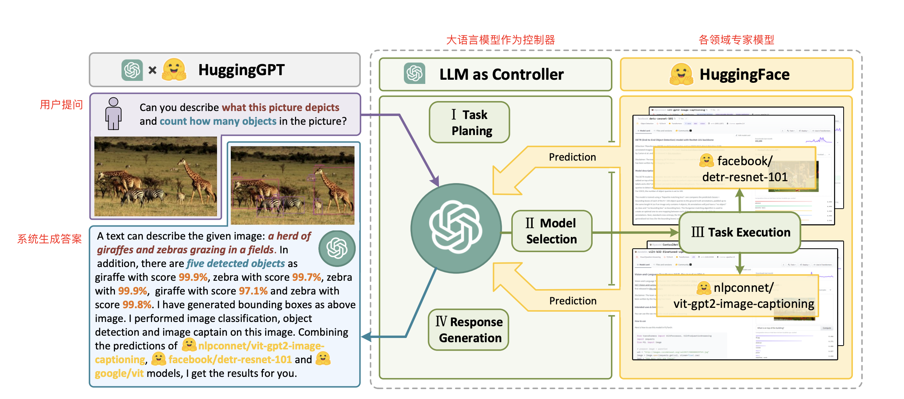
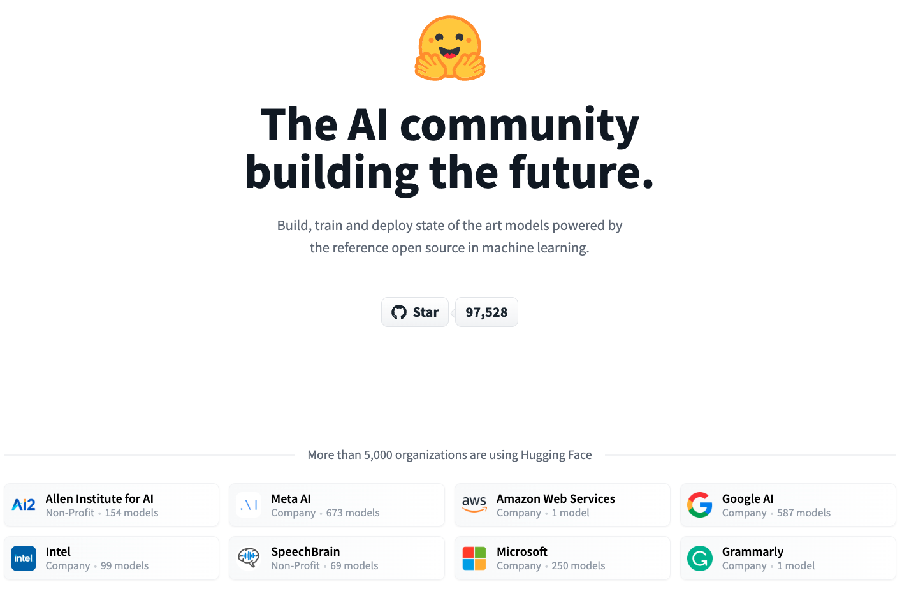
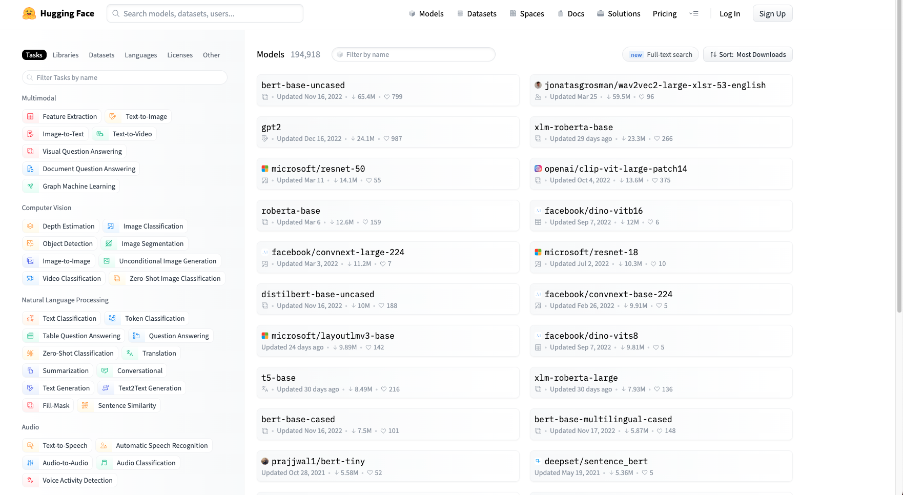
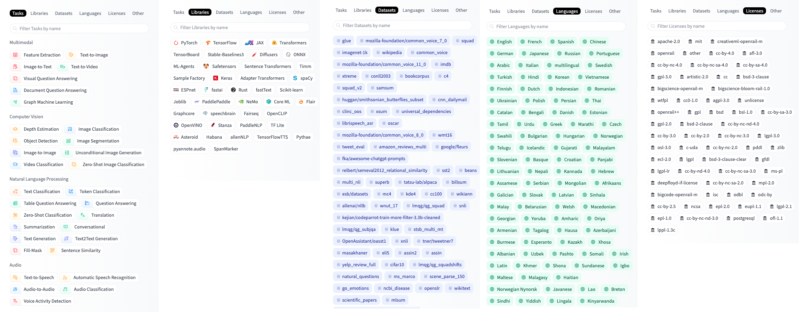

# HuggingGPT 介绍

## 实验介绍

浙江大学和微软亚洲研究院的研究者提出了一种让大语言模型连接机器学习社区中各种模型以解决复杂任务的系统——HuggingGPT。在本节课程中，我们将介绍 HuggingGPT 的基本原理，以及其使用方法。

#### 知识点

- HuggingGPT 介绍
- HuggingFace 介绍
- 在线使用 HuggingGPT

## HuggingGPT 介绍

如下图，你给系统下达一个任务：图片中有几种动物？每种有几只？系统可以帮你自动分析完成这个任务需要哪些模型，然后直接去调用可用的模型来帮你执行并完成整个过程。在这个过程中你只需要使用自然语言作为输入。

HuggingGPT 实际上是一个协作系统，以大语言模型（这里是 ChatGPT）作为控制器，各个领域的专家模型作为协同执行器。其工作流程共分为四个阶段：

1. 任务规划：大语言模型将用户的需求解析为任务列表，并确定任务之间的执行顺序和资源依赖关系。
2. 模型选择：大语言模型根据各专家模型的描述，为任务分配合适的模型。
3. 任务执行：被选定的专家模型根据任务顺序和依赖关系执行分配的任务，并将执行信息和结果给到大语言模型。
4. 响应生成：由大语言模型总结各专家模型的执行过程日志和推理结果，给出最终的输出。

在大语言模型和领域模型的配合下，它可用来解决语言、图像、音频、视频等多种模态的任务，任务类型包含检测、生成、分类、问答等。

### HuggingFace 介绍

那么大语言模型是如何去调用专家的模型呢？答案是专家模型都托管在 [HuggingFace](https://huggingface.co/) 上。

HuggingFace（拥抱脸）早期是一家致力于开发自然语言处理技术的公司。

HuggingFace 从 PyTorch 版本的 BERT 就开源了模型库 Transformers，另外 HuggingFace 还在官网提供了自然语言领域大量 state-of-art 的预训练语言模型结构的模型和调用框架，后面逐渐囊括了视觉、语音等领域，目前已成为了机器学习界的 GitHub——目前已经共享了超 15w 个预训练模型，3w 个数据集。

登录 HuggingFace 的 [Models](https://huggingface.co/models) 版块：

可以看到右侧是按照下载量排序的开源模型，也可以按点赞数进行排序。左侧则是筛选栏，各个模型可以根据任务类型、训练时使用的深度学习框架、使用的数据集、使用的语言、许可证进行筛选。

但分享预训练模型，只能算是一个 model zoo（模型商店），即简单的模型上传分享与下载。因此 HuggingFace 还做了 Spaces 模块，让用户可以基于分享的预训练模型进行二次开发。

## HuggingGPT 使用演示

HuggingFace 的 Spaces 提供了 HuggingGPT 的[在线版本](https://huggingface.co/spaces/microsoft/HuggingGPT)，让我们来看看如何使用这个在线版本。

<iframe height=450 width=800 src="./README.assets/huggingGPT.mp4" frameborder=0 allowfullscreen> </iframe>

这里要注意的是，在线版本由于硬件性能的原因，并没有使用所有的专家模型进行推理，因此任务执行的可靠性并不高。

如果你想完全释放 HuggingGPT 的性能，可以在本地执行该项目，[HuggingGPT](https://github.com/microsoft/JARVIS) 项目目前已在 GitHub 开源。

以下是官方推荐的硬件配置：

- 显存 ≥≥ 24GB
- 内存 >> 12GB（最小）16GB（标准）80GB (满配)
- 硬盘 >> 284GB

## 实验总结

通过本节实验的介绍，详细大家对 HuggingGPT 有了初步的认识，那么 HuggingGPT 可以执行哪些任务呢，换句话说，专家模型有哪些？课程接下来将详细介绍各个领域的模型与解决方案。