# 视觉领域任务与模型

## 实验介绍

本节实验将介绍 HuggingFace Models 上视觉领域的任务与模型。视觉领域的任务旨在让计算机能够理解和分析图像、视频等视觉信息。

#### 知识点

- 图像分类
- 零样本图像分类
- 目标检测
- 图像分割
- 图像到图像转换

## 图像分类

图像分类（Image Classification）是计算机视觉中最常见和基础的任务之一，旨在将输入的图像分配到预定义的类别中。在图像分类任务中，模型需要学习从图像中提取特征，并将其与不同类别的特征进行比较，最终确定图像所属的类别。

在这里我们使用最经典的网络 [ResNet50](https://huggingface.co/microsoft/resnet-50) 进行演示：

<iframe height=450 width=800 src="./3.assets/image_classify.mp4" frameborder=0 allowfullscreen> </iframe>

## 零样本图像分类

零样本图像分类（Zero-Shot Image Classification）任务是也一种图像分类问题，其中模型需要对没有在训练过程中见过的类别进行分类。与传统的图像分类任务不同，零样本图像分类任务要求模型具备对新类别的泛化能力，即在没有针对新类别的标记样本的情况下，能够将其正确分类。

在传统的图像分类任务中，模型需要使用已标记的训练样本学习各个类别的特征和模式。然而，在零样本图像分类任务中，新类别的样本在训练阶段是不可用的。相反，模型通过利用附加的语义描述或属性信息来了解新类别，例如使用类别的文本描述、属性向量、语义嵌入等。

在这里我们使用 OpenAI 开源的 [CLIP-ViT](https://huggingface.co/openai/clip-vit-base-patch16) 模型进行演示，这里 CLIP 一种基于对比文本-图像对的预训练方法，ViT 是具体的模型结构。

<iframe height=450 width=800 src="./3.assets/zero_shot_image_classify.mp4" frameborder=0 allowfullscreen> </iframe>

## 目标检测

目标检测（Object Detection）任务旨在从图像或视频中检测和定位出特定目标的位置和类别。目标检测任务不仅要识别出图像中的目标，还要提供目标的边界框（Bounding Box）。

目标检测在许多领域中都有广泛的应用，如智能监控、自动驾驶、图像搜索、物体识别等。它对于实时场景中的目标定位和跟踪非常重要。

<iframe height=450 width=800 src="./3.assets/object_detect.mp4" frameborder=0 allowfullscreen> </iframe>

## 图像分割

图像分割（Image Segmentation）任务旨在将图像分割为多个区域或像素级别的组成部分，使得每个区域或像素属于特定的对象、目标或语义类别。图像分割任务要求对图像的每个像素进行分类或标记，以实现对图像的详细理解和区域识别。

图像分割在许多领域中都有广泛的应用，如医学影像分析、自动驾驶、图像编辑、目标识别和增强现实等。它提供了更精细和详细的图像解释，使计算机能够更好地理解图像中的对象、轮廓和边界。

图像分割任务可以分为两种主要类型：

1. 语义分割（Semantic Segmentation）：语义分割任务旨在将图像分割成多个语义类别的区域，即为图像中的每个像素分配一个语义标签。这样可以将图像中的每个像素与特定的物体、区域或类别关联起来。
2. 实例分割（Instance Segmentation）：实例分割任务不仅要将图像分割为语义区域，还要对不同的目标或实例进行区分。即为图像中的每个像素分配一个语义标签，并标识不同目标或实例的边界框。

在这里我们使用训练于城市数据上的 [UperNet-ConvNeXt](https://huggingface.co/openmmlab/upernet-convnext-small) 模型进行演示：

<iframe height=450 width=800 src="./3.assets/segment.mp4" frameborder=0 allowfullscreen> </iframe>

## 图像到图像转换

图像到图像转换（Image-to-Image）任务旨在将输入图像转换为输出图像，通过对输入图像进行不同形式的处理和转换，实现对图像的改变或重建。这类任务通常涉及图像的转换、重建、修复或增强。

在图像到图像转换任务中，输入图像和输出图像之间的变换可以是多样的，取决于具体的任务需求。以下是一些常见的任务类型：

1. 图像风格转换（Image Style Transfer）：将输入图像的风格或特征转移到输出图像上，使其具有不同的艺术风格、颜色分布或纹理特征。这类任务可以用于将一种图像的风格应用到另一种图像上，例如将一张照片转换为油画风格的图像。
2. 图像超分辨率重建（Image Super-Resolution）：通过从低分辨率输入图像生成高分辨率输出图像，提高图像的清晰度和细节。这类任务对于从模糊或低质量图像中恢复高质量图像具有重要意义。
3. 图像语义分割（Image Semantic Segmentation）：将输入图像分割为像素级别的语义类别，为图像中的每个像素分配相应的类别标签。这类任务可以实现图像的语义理解和像素级别的区分。
4. 图像去噪（Image Denoising）：从输入图像中去除噪声，恢复图像的清晰度和细节。这类任务可以提高图像的质量和可视化效果。
5. 图像修复（Image Inpainting）：根据输入图像的上下文和内容，填补图像中的缺失或损坏部分，恢复图像的完整性和连贯性。
6. 图像颜色化（Image Colorization）：将灰度图像转换为彩色图像，为图像中的每个像素分配合适的颜色。这类任务可以将黑白照片转换为彩色图像，增加图像的真实感和视觉吸引力。

在这里我们使用 ControlNet 家族的 [ControlNet-Canny](https://huggingface.co/lllyasviel/sd-controlnet-canny) 模型进行演示，这是一个图像颜色化的模型。

<iframe height=450 width=800 src="./3.assets/image2image.mp4" frameborder=0 allowfullscreen> </iframe>

关于 ControlNet，它通过添加额外的条件（即控制图像，Control Image）来控制扩散模型，为 Stable Diffusion 带来了前所未有的控制水平，它既可以单独使用，也可以集成到 Stable Diffusion 中使用。

ControlNet 很好的解决了文生图大模型的关键问题：单纯的关键词的控制方式无法满足对细节控制的需要。

以下是 ControlNet 家族的模型列表：

| 模型名称                          | 控制图像描述     | 控制图像样例                                               | 生成输出样例                                               |
| --------------------------------- | ---------------- | ---------------------------------------------------------- | ---------------------------------------------------------- |
| lllyasviel/sd-controlnet-canny    | Canny 边缘检测图 | 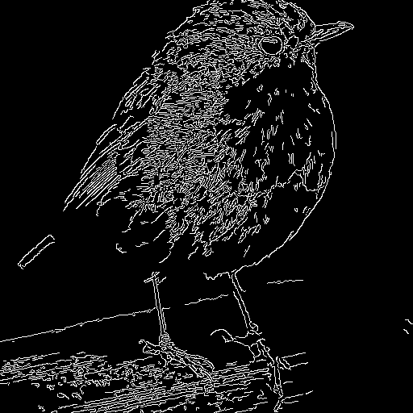 |  |
| lllyasviel/sd-controlnet-depth    | 深度图           | 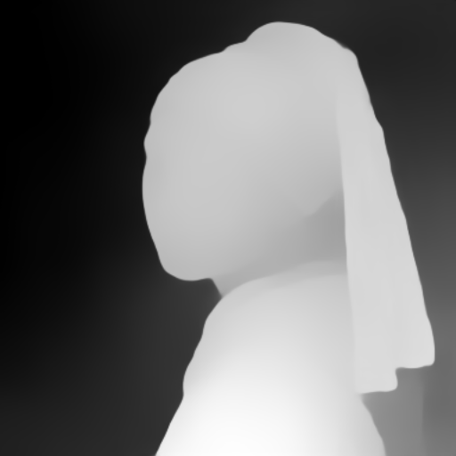 | 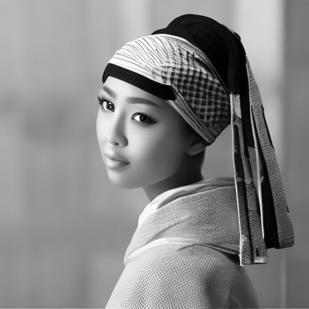 |
| lllyasviel/sd-controlnet-hed      | HED 边缘检测图   | 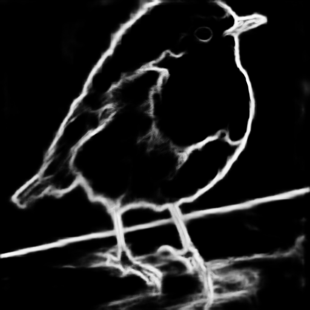 |  |
| lllyasviel/sd-controlnet-mlsd     | M-LSD 直线检测图 | 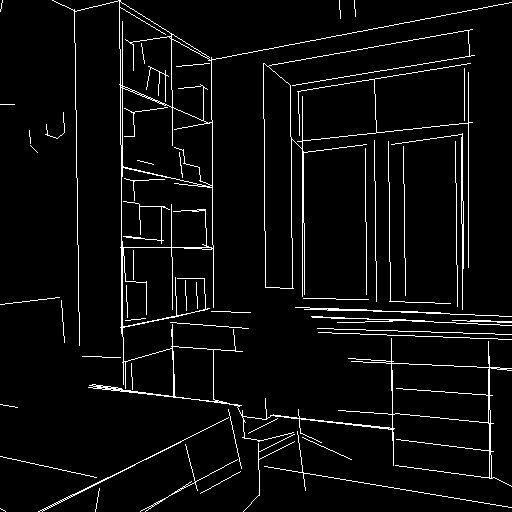 |  |
| lllyasviel/sd-controlnet-normal   | 法线图           | 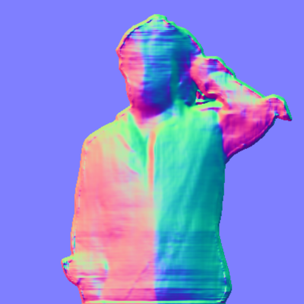 | 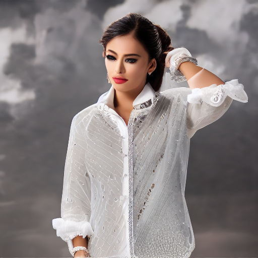 |
| lllyasviel/sd-controlnet_openpose | 人体姿态图       | 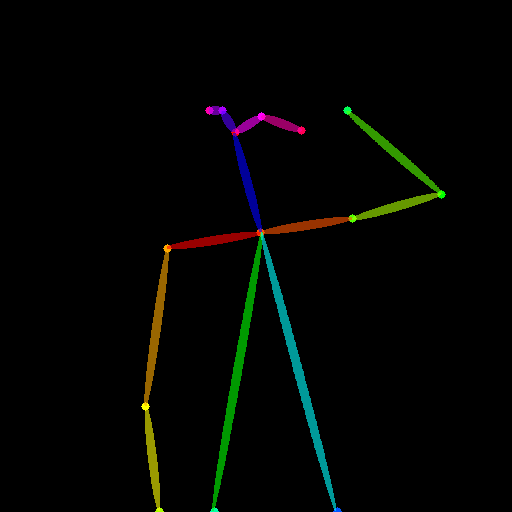 | 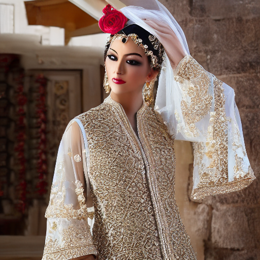 |
| lllyasviel/sd-controlnet_scribble | 涂鸦图           | 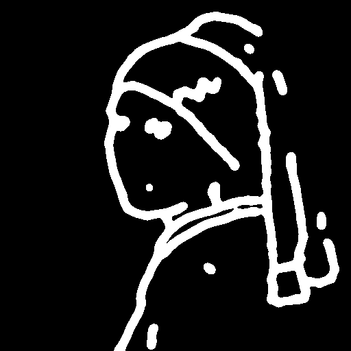 | 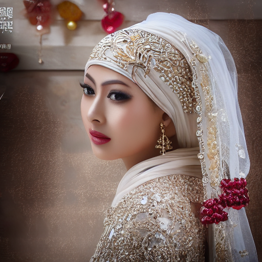 |
| lllyasviel/sd-controlnet_seg      | 分割图           | 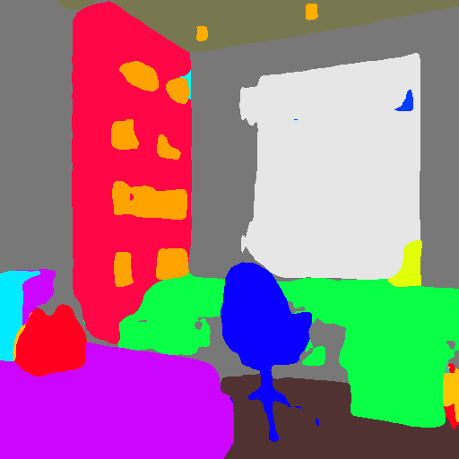 | 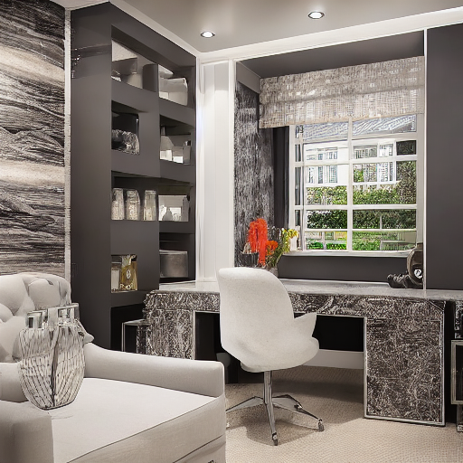 |

## 实验总结

本节实验探索了视觉领域的各种任务和模型，通过学习相信大家对这些任务和模型有了更深入的理解，对于现实中的应用场景能够更好地应用这些模型和技术。

除了上述演示的任务以外，视觉领域还有如深度估计（Depth Estimation）、人体姿态估计（Human Pose Estimation）、行人重识别（ReID）、视频分类（Video Classification）和传统视觉领域的边缘检测（Edge Detection）、直线检测（Line Detection）等其他任务，感兴趣的同学可以自行查阅相关文献与代码进行学习。

接下来，我们将介绍语音领域的任务与模型。