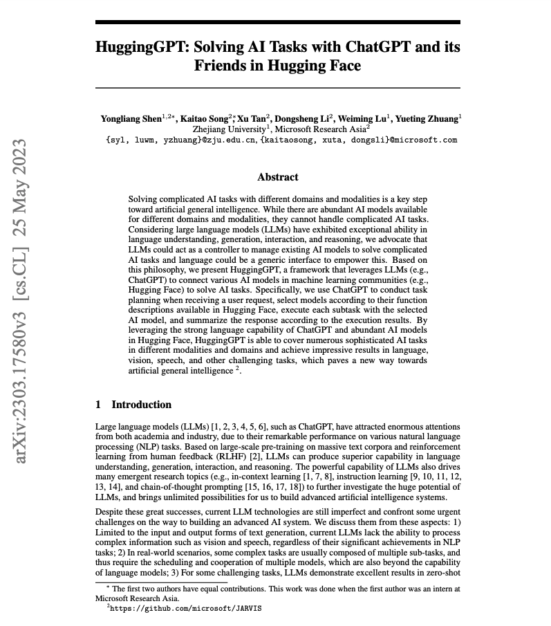

# 多模态领域任务与模型

## 实验介绍

本节实验将介绍 HuggingFace Models 上多模态领域的任务与模型。多模态任务指的是涉及多种不同模态（如文本、图像、音频等）的任务，这些不同模态的数据通常需要进行联合处理和分析。多模态任务旨在通过联合分析这些信息，从而实现更加全面和准确的理解和处理。

#### 知识点

- 文本生成图片
- 文本生成视频
- 图片生成文本
- 视觉问答
- 文档问答

## 文本生成图片

文本生成图片（Text-to-Image）任务旨在将给定的文本描述转换为相应的图像。在这种任务中，模型需要理解文本的语义和上下文，并生成与文本描述相匹配的视觉内容的图像。

在这里我们使用 [Stable Diffusion v1-5](https://huggingface.co/runwayml/stable-diffusion-v1-5) 模型进行演示：

<iframe height=450 width=800 src="./5.assets/text2image.mp4" frameborder=0 allowfullscreen> </iframe>

## 图片生成文本

图片生成文本（Image-to-Text）任务旨在将给定的图片转换为相应的文本描述。在这种任务中，模型需要理解图像的内容和语义，并生成与图像相匹配的自然语言描述。

在这里我们使用基于 [ViT-GPT2](https://huggingface.co/nlpconnect/vit-gpt2-image-captioning) 结构的模型进行演示：

<iframe height=450 width=800 src="./5.assets/image2text.mp4" frameborder=0 allowfullscreen> </iframe>

## 视觉问答

视觉问答（Visual Question Answering）任务旨在根据给定的图像和相关问题，从图像中理解并回答问题。该任务要求模型同时理解图像内容和文本问题，并生成与问题相关的文本答案。

视觉问答任务融合了计算机视觉和自然语言处理领域的技术，对模型在多模态理解和推理上提出了挑战。它不仅需要模型能够理解图像中的视觉信息，还需要模型能够理解问题中的语义和推理关系，从而生成准确的答案。

在这里我们使用基于 [ViLT](https://huggingface.co/dandelin/vilt-b32-finetuned-vqa) 结构的模型进行演示：

<iframe height=450 width=800 src="./5.assets/visual_qa.mp4" frameborder=0 allowfullscreen> </iframe>

## 文档问答

文档问答（Document Question Answering）任务是指在给定的文档集合中，根据用户提出的问题，从文档中找到准确的答案。这个任务要求模型能够理解问题的语义，并从文档中检索和推理相关信息，以生成或提取准确的答案。

文档问答任务常用于信息检索、问答系统、文档摘要等领域。它需要模型能够理解文档的内容和结构，并结合问题的语义和上下文信息，进行信息检索和推理，以生成准确的答案。

基于深度学习的文档问答是一种端到端的方式，不需要像传统 OCR 那样，先做文字识别，然后再对识别后的文字进行文本领域任务的执行，这种执行方式还会受到复杂版面、语义理解的影响。

在这里我们使用 [LayoutLM](https://huggingface.co/impira/layoutlm-document-qa) 家族的模型进行演示，问答图片使用 HuggingGPT 论文第一页的截图：

<iframe height=450 width=800 src="./5.assets/doc_qa.mp4" frameborder=0 allowfullscreen> </iframe>

## 实验总结

本节实验讲解了多模态领域的各种任务和模型，除了上述演示的任务以外，多模态领域还包括如文本生成视频（Text-to-Video）、文本生成音频（Text-to-Audio）等其他任务。

至此，关于 HuggingFace 上所有可演示的任务和模型均已介绍完毕，相信各位已经知道目前 HuggingGPT 现在可以做哪些任务，不能做哪些任务了。

接下来，我们将通过解读 HuggingGPT 的源码，进一步了解其工作原理。