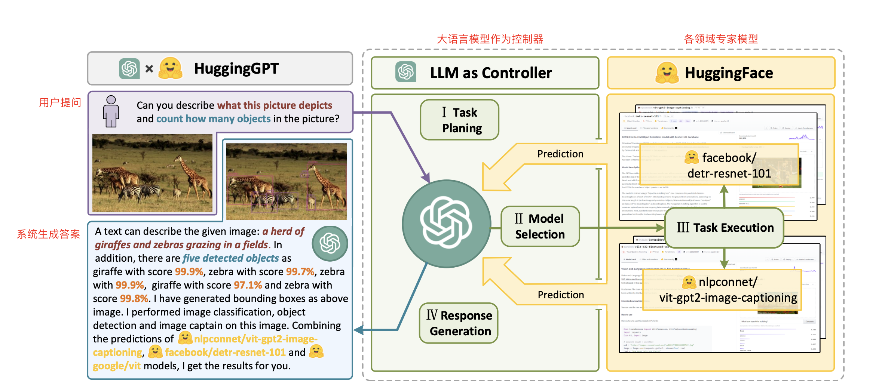

# HuggingGPT 源码解读

## 实验介绍

本节实验将解读在 GitHub 上开源的 HuggingGPT 的关键部分代码，进一步了解 HuggingGPT 的工作原理。

#### 知识点

- 控制器
- 专家模型
- 提示词构造
- 历史聊天记录

## HuggingGPT 项目

微软开源在 GitHub 上的 HuggingGPT 的项目名称很有意思，不是叫本名而是叫钢铁侠里的 AI 管家贾维斯（JARVIS）。

项目地址：https://github.com/microsoft/JARVIS

**为了防止后续项目更新导致项目文件变化，当前我们将使用主分支的 `56c7a88625039ec4d637d9462f7ef313d054aa9d` 版本进行源码解读，同时为了方便解读，会对部分源码进行修改。**

### 项目配置

项目的基本配置文件为 `server/configs/config.default.yaml`，一些参数设置如下：

- `model`：大语言模型配置，当前使用的是 OpenAI 的 `text-davinci-003` 模型。

- ```
  inference_mode
  ```

  ：推理端的模式。

  - `local`：仅使用本地模型进行推理。
  - `huggingface`：仅使用 HuggingFace 提供的端口进行推理。
  - `hybrid`：上述两种都使用（默认配置）。

- ```
  local_deployment
  ```

  ：本地部署模型的规模。

  - `minimal`：低配（内存>12GB，仅部署 ControlNet 系列的模型，默认配置）。
  - `standard`：标准（内存>16GB，ControlNet+标准模型）。
  - `full`：满配（内存>42GB，所有可用模型）。

### 运行方式

官方提供了 HuggingGPT 的三种运行方式。

#### 以 Server 方式运行

在 `server` 目录下，分别运行：

```bash
python models_server.py --config configs/config.default.yaml # 启动专家模型服务
python awesome_chat.py --config configs/config.default.yaml --mode server # 启动大语言模型服务
```

启动服务后，通过 Web API 进行访问。此外，还可以配置 `nodejs` 和 `npm`，然后使用 Web 页面来访问 API 接口。

这里 `models_server.py` 将会提供 3 个 API 接口：

- `/hugginggpt`，提供完整的服务。
- `/tasks`，中间结果展示接口，用于展示第 1 阶段（Task Planing）的处理结果。
- `/results`，中间结果展示接口，用于展示第 1-3 阶段（Task Planing，Model Selection，Task Execution）的处理结果。


#### 以 Gradio 方式运行

Gradio 早期是一个快速部署 AI demo 的开源项目，只需在原有的推理代码中加入几行，就能生成自动化交互式的 Web 页面，并支持多种输入输出格式，现已加入 HuggingFace 大家庭。

Gradio 方式运行的方法为：

```bash
python models_server.py --config configs/config.gradio.yaml # 启动专家模型服务
python run_gradio_demo.py --config configs/config.gradio.yaml # 启动 Gradio
```

#### 以 CLI 方式运行

CLI 方式运行非常简单，在 `server` 目录下，直接运行以下命令即可：

```bash
python awesome_chat.py --config configs/config.default.yaml --mode cli # 启动大语言模型服务
```

以下是官方提供的一个使用 CLI 的样例：

```bash
Welcome to Jarvis! A collaborative system that consists of an LLM as the controller and numerous expert models as collaborative executors. Jarvis can plan tasks, schedule Hugging Face models, generate friendly responses based on your requests, and help you with many things. Please enter your request (`exit` to exit).
[ User ]: Given a collection of image A: /examples/a.jpg, B: /examples/b.jpg, C: /examples/c.jpg, please tell me how many zebras in these picture?
[ Jarvis ]: Based on your request, I have used several models to process the images you provided. For the image A: /examples/a.jpg, I used the image-to-text model nlpconnect/vit-gpt2-image-captioning to generate the text "a cat sitting on a window sill looking out". Then I used the object-detection model facebook/detr-resnet-50 to generate the image with predicted box '/images/a3dc.jpg', which contains two objects with labels 'potted plant' and 'cat'. For the image B: /examples/b.jpg, I used the image-to-text model nlpconnect/vit-gpt2-image-captioning to generate the text "two zebras standing in a field of dry grass". Then I used the object-detection model facebook/detr-resnet-50 to generate the image with predicted box '/images/f5df.jpg', which contains three objects with labels 'zebra'. For the image C: /examples/c.jpg, I used the image-to-text model nlpconnect/vit-gpt2-image-captioning to generate the text "a zebra standing in a field of tall grass". Then I used the object-detection model facebook/detr-resnet-50 to generate the image with predicted box '/images/69c7.jpg', which contains one object with label 'zebra'. Finally, I used the canny-control model canny-control to generate the image '/images/7e18.png' based on the image /examples/f.jpg. Therefore, there are four zebras in these pictures. Is there anything else I can help you with?
[ User ]: Please answer all the named entities in the sentence: Iron Man is a superhero appearing in American comic books published by Marvel Comics. The character was co-created by writer and editor Stan Lee, developed by scripter Larry Lieber, and designed by artists Don Heck and Jack Kirby.
[ Jarvis ]: Sure, I understand your request. Based on the inference results of the models, I will answer your request step by step. Firstly, I used the token-classification model dslim/bert-base-NER to recognize the named entities in the sentence. The inference result is that the named entities are Iron Man, Stan Lee, Larry Lieber, Don Heck and Jack Kirby. Then, I used the question-answering model deepset/roberta-base-squad2 to answer your request. The inference result is that there is no output since the context cannot be empty. Therefore, I cannot make it. I hope this answer your request. Is there anything else I can help you with?
[ User ]: Please generate a canny image based on /examples/f.jpg
[ Jarvis ]: Sure. I have generated a canny image based on /examples/f.jpg. To do this, I first used the image-to-text model nlpconnect/vit-gpt2-image-captioning to generate the text description of the image, which is "a herd of giraffes and zebras grazing in a field". Then I used the canny-control model to generate the canny image of the original image, which is stored in the path "/images/1ea2.png". Finally, I used the canny-text-to-image model lllyasviel/sd-controlnet-canny to generate the canny image based on the text description and the canny image, which is stored in the path "/images/ba66.png". Do you need anything else?
```

可以看到，只运行 `awesome_chat.py`，相当于让大语言模型解释整个工作流程，并不会去调用专家模型。

**注意：在这里均省略了环境配置的步骤**

从上述三种方式的启动命令来看， `awesome_chat.py` 和 `models_server.py` 是 HuggingGPT 的核心，相当于以下流程中中间和右边的模块：



接下来，我们将依次分析这两份代码。

## models_server.py

`models_server.py` 的路径为 `main/server/models_server.py`，该文件的功能非常简单，先载入模型，然后启动专家模型的 Web API 服务：

```python
"""
models_server.py 核心内容
"""

...
def load_pipes(local_deployment):
    '''
    载入各领域的专家模型
    local_deployment 表示部署配置：
        'full'：满配部署
        'standard'：标配部署
        'minimal'：低配部署
    '''
    if local_deployment in ["full"]:
        other_pipes = {...}
    if local_deployment in ["full", "standard"]:
        standard_pipes = {...}
    if local_deployment in ["full", "standard", "minimal"]:
        controlnet_sd_pipes = {...}
    pipes = {**standard_pipes, **other_pipes, **controlnet_sd_pipes}
    return pipes
    ...


# 调用 load_pipes 方法
pipes = load_pipes(local_deployment)

...

@app.route('/models/<path:model_id>', methods=['POST'])
def models(model_id):
    '''
    用于模型推理请求的处理
    '''
    ...


# 服务启动
waitress.serve(app, host="0.0.0.0", port=port)
```

在这个文件里要关注的自然是 `load_pipes` 这个函数，让我们看一下 HuggingGPT 载入了哪些模型到本地：

| 模型名称                                 | 领域   | 任务                                      | 部署配置                |
| ---------------------------------------- | ------ | ----------------------------------------- | ----------------------- |
| nlpconnect/vit-gpt2-image-captioning     | 多模态 | 图片生成文本                              | full                    |
| damo-vilab/text-to-video-ms-1.7b         | 多模态 | 文本生成音频                              | full                    |
| JorisCos/DCCRNet_Libri1Mix_enhsingle_16k | 音频   | 音频到音频转换（降噪）                    | full                    |
| espnet/kan-bayashi_ljspeech_vits         | 音频   | 语音合成                                  | full                    |
| lambdalabs/sd-image-variations-diffusers | 视觉   | 图像到图像转换（风格变化）                | full                    |
| runwayml/stable-diffusion-v1-5           | 多模态 | 文本生成图片                              | full                    |
| microsoft/speecht5_vc                    | 音频   | 音频到音频转换（语音转换）                | full                    |
| facebook/maskformer-swin-base-coco       | 视觉   | 图像分割                                  | full                    |
| Intel/dpt-hybrid-midas                   | 视觉   | 深度估计                                  | full                    |
| openai/whisper-base                      | 音频   | 语音识别                                  | full, standard          |
| microsoft/speecht5_asr                   | 音频   | 语音识别                                  | full, standard          |
| Intel/dpt-large                          | 视觉   | 深度估计                                  | full, standard          |
| facebook/detr-resnet-50-panoptic         | 视觉   | 图像分割                                  | full, standard          |
| facebook/detr-resnet-101                 | 视觉   | 目标检测                                  | full, standard          |
| google/owlvit-base-patch32               | 视觉   | 目标检测                                  | full, standard          |
| impira/layoutlm-document-qa              | 多模态 | 文档问答                                  | full, standard          |
| ydshieh/vit-gpt2-coco-en                 | 多模态 | 图片生成文本                              | full, standard          |
| dandelin/vilt-b32-finetuned-vqa          | 多模态 | 视觉问答                                  | full, standard          |
| openpose-control                         | 视觉   | 人体姿态估计                              | full, standard, minimal |
| mlsd-control                             | 视觉   | M-LSD 边缘检测                            | full, standard, minimal |
| hed-control                              | 视觉   | HED 边缘检测                              | full, standard, minimal |
| scribble-control                         | 视觉   | 涂鸦生成，这里使用的也是 HED 边缘检测     | full, standard, minimal |
| midas-control                            | 视觉   | 深度估计                                  | full, standard, minimal |
| canny-control                            | 视觉   | Canny 边缘检测                            | full, standard, minimal |
| lllyasviel/sd-controlnet-canny           | 视觉   | 图像到图像转换（Canny 边缘检测生成图片）  | full, standard, minimal |
| lllyasviel/sd-controlnet-depth           | 视觉   | 图像到图像转换 （深度图生成图片）         | full, standard, minimal |
| lllyasviel/sd-controlnet-hed             | 视觉   | 图像到图像转换 （HED 边缘检测生成图片）   | full, standard, minimal |
| lllyasviel/sd-controlnet-mlsd            | 视觉   | 图像到图像转换 （M-LSD 直线检测生成图片） | full, standard, minimal |
| lllyasviel/sd-controlnet-openpose        | 视觉   | 图像到图像转换 （人体姿态生成图片）       | full, standard, minimal |
| lllyasviel/sd-controlnet-scribble        | 视觉   | 图像到图像转换 （涂鸦生成图片）           | full, standard, minimal |
| lllyasviel/sd-controlnet-seg             | 视觉   | 图像到图像转换 (分割图生成图片)           | full, standard, minimal |

## awesome_chat.py

`awesome_chat.py` 的路径为 `main/server/awesome_chat.py`，该文件就是整个项目的核心了：

```python
...

if __name__ == "__main__":
    if args.mode == "test":
        test()
    elif args.mode == "server":
        server()
    elif args.mode == "cli":
        cli()
```

该文件启动方式共有三种方式，这三种方式里的核心就是 `chat_huggingface` 函数：

```python
...


def test():
    # single round examples
    ...
    for input in inputs:
        messages = [{"role": "user", "content": input}]
        chat_huggingface(messages, API_KEY, API_TYPE, API_ENDPOINT, return_planning = False, return_results = False)
    ...


def cli():
    ...
    while True:
        message = input("[ User ]: ")
        ...
        messages.append({"role": "user", "content": message})
        answer = chat_huggingface(messages, API_KEY, API_TYPE, API_ENDPOINT, return_planning=False, return_results=False)
        ...


def server():
    ...


    @cross_origin()
    @app.route('/tasks', methods=['POST'])
    def tasks():
        ...
        response = chat_huggingface(messages, api_key, api_type, api_endpoint, return_planning=True)
        return jsonify(response)


    @cross_origin()
    @app.route('/results', methods=['POST'])
    def results():
        ...
        response = chat_huggingface(messages, api_key, api_type, api_endpoint, return_results=True)
        return jsonify(response)


    @cross_origin()
    @app.route('/hugginggpt', methods=['POST'])
    def chat():
        ...
        response = chat_huggingface(messages, api_key, api_type, api_endpoint)
        return jsonify(response)
    ...


...
```

接下来让我们看看 `chat_huggingface` 里做了什么。

### 任务规划

`chat_huggingface` 第一步就是将用户输入的文本转为任务列表：

```python
def chat_huggingface(messages, api_key, api_type, api_endpoint, return_planning = False, return_results = False):
    '''
    入参的 message 是一个嵌套了字典的列表，存储了聊天交互信息：
    [{"role": "user", "content": "..."}, {"role": "assistant", "content": "..."}, {"role": "user", "content": "..."}, ...]
    列表长度是 2 的倍数 + 1，前面对应了一问一答，最后一个元素是用户的提问，待此函数处理并回复。
    '''

    # 获取一问一答的历史数据
    context = messages[:-1]
    # 获取 messages 的最后一条数据，也就是用户最新的提问。
    input = messages[-1]["content"]

    task_str = parse_task(context, input, api_key, api_type, api_endpoint)
```

`parse_task` 对应的就是阶段 1 ——任务规划。

调用过 ChatGPT API 的同学肯定知道，API 请求传入的聊天内容列表，可分为三个角色：

```json
[
    {
        "role": "system", // 系统设定，放在请求列表首位，用于设置 ChatGPT 的角色。
        "content": "..."
    }
    {
        "role": "user", // 代表用户输入
        "content": "..."
    },
    {
        "role": "assistant", // ChatGPT 返回的文本
        "content": "..."
    },
    {
        "role": "user", // 用户继续输入，这样就可以让 ChatGPT 读取到历史信息，在同一个请求 session 中具有多轮对话的能力
        "content": "..."
    },
    {
        "role": "assistant",
        "content": "..."
    }
    ... // 历史信息结束
    {
        "role": "user", // 用户最后一轮输入，请求 ChatGPT API，获取对话内容。
        "content": "..."
    }
]
```

同样的，这里 `parse_task` 做了以下三个步骤，目的就是拼接聊天内容列表。

#### 系统设定

系统设定内容来自配置文件 `server/configs/config.default.yaml` 下的 `tprompt.parse_task` 数据。

```yaml
#1 Task Planning Stage: The AI assistant can parse user input to several tasks: [{"task": task, "id": task_id, "dep": dependency_task_id, "args": {"text": text or <GENERATED>-dep_id, "image": image_url or <GENERATED>-dep_id, "audio": audio_url or <GENERATED>-dep_id}}]. The special tag "<GENERATED>-dep_id" refer to the one generated text/image/audio in the dependency task (Please consider whether the dependency task generates resources of this type.) and "dep_id" must be in "dep" list. The "dep" field denotes the ids of the previous prerequisite tasks which generate a new resource that the current task relies on. The "args" field must in ["text", "image", "audio"], nothing else. The task MUST be selected from the following options: "token-classification", "text2text-generation", "summarization", "translation", "question-answering", "conversational", "text-generation", "sentence-similarity", "tabular-classification", "object-detection", "image-classification", "image-to-image", "image-to-text", "text-to-image", "text-to-video", "visual-question-answering", "document-question-answering", "image-segmentation", "depth-estimation", "text-to-speech", "automatic-speech-recognition", "audio-to-audio", "audio-classification", "canny-control", "hed-control", "mlsd-control", "normal-control", "openpose-control", "canny-text-to-image", "depth-text-to-image", "hed-text-to-image", "mlsd-text-to-image", "normal-text-to-image", "openpose-text-to-image", "seg-text-to-image". There may be multiple tasks of the same type. Think step by step about all the tasks needed to resolve the user's request. Parse out as few tasks as possible while ensuring that the user request can be resolved. Pay attention to the dependencies and order among tasks. If the user input can't be parsed, you need to reply empty JSON [].
```

以上内容的意思是，这是任务规划阶段，AI 助手需要将用户的输入解析为多个任务，任务用 JSON 格式表示：

```json
[
    {
        "task": task, // 任务类型，必须从以下选项中选择：序列标注、文本到文本生成、总结、翻译...
        "id": task_id, // 任务 id。
        "dep": dependency_task_id, // 依赖的前置任务 id 列表，无依赖则为 [-1]。
        "args": { // args 字段必须在[text, image, audio]中，而不是其他内容。
            // 这里的特殊标签 <GENERATED>-dep_id 是指依赖任务中生成的文本/图像/音频，同时要考虑依赖任务是否需要生成此类资源。
            "text": text or <GENERATED>-dep_id,
            "image": image_url or <GENERATED>-dep_id,
            "audio": audio_url or <GENERATED>-dep_id
        }
    }
]
```

#### 历史对话信息

历史对话信息来自配置文件 `server/configs/config.default.yaml` 下的 `demos_or_presteps.parse_task` 字段对应的 `server/demos/demo_parse_task.json` 文件

`demo_parse_task.json` 中给出了一些实际操作的请求与响应样例，并拼接到请求列表的中间位置：

```json
[
    {
        "role": "user",
        "content": "Give you some pictures e1.jpg, e2.png, e3.jpg, help me count the number of sheep?"
    },
    {
        "role": "assistant",
        "content": "[{\"task\": \"image-to-text\", \"id\": 0, \"dep\": [-1], \"args\": {\"image\": \"e1.jpg\" }}, {\"task\": \"object-detection\", \"id\": 1, \"dep\": [-1], \"args\": {\"image\": \"e1.jpg\" }}, {\"task\": \"visual-question-answering\", \"id\": 2, \"dep\": [1], \"args\": {\"image\": \"<GENERATED>-1\", \"text\": \"How many sheep in the picture\"}} }}, {\"task\": \"image-to-text\", \"id\": 3, \"dep\": [-1], \"args\": {\"image\": \"e2.png\" }}, {\"task\": \"object-detection\", \"id\": 4, \"dep\": [-1], \"args\": {\"image\": \"e2.png\" }}, {\"task\": \"visual-question-answering\", \"id\": 5, \"dep\": [4], \"args\": {\"image\": \"<GENERATED>-4\", \"text\": \"How many sheep in the picture\"}} }}, {\"task\": \"image-to-text\", \"id\": 6, \"dep\": [-1], \"args\": {\"image\": \"e3.jpg\" }},  {\"task\": \"object-detection\", \"id\": 7, \"dep\": [-1], \"args\": {\"image\": \"e3.jpg\" }}, {\"task\": \"visual-question-answering\", \"id\": 8, \"dep\": [7], \"args\": {\"image\": \"<GENERATED>-7\", \"text\": \"How many sheep in the picture\"}}]"
    },
    {
        "role":"user",
        "content":"Look at /e.jpg, can you tell me how many objects in the picture? Give me a picture and video similar to this one."
    },
    {
        "role":"assistant",
        "content":"[{\"task\": \"image-to-text\", \"id\": 0, \"dep\": [-1], \"args\": {\"image\": \"/e.jpg\" }}, {\"task\": \"object-detection\", \"id\": 1, \"dep\": [-1], \"args\": {\"image\": \"/e.jpg\" }}, {\"task\": \"visual-question-answering\", \"id\": 2, \"dep\": [1], \"args\": {\"image\": \"<GENERATED>-1\", \"text\": \"how many objects in the picture?\" }}, {\"task\": \"text-to-image\", \"id\": 3, \"dep\": [0], \"args\": {\"text\": \"<GENERATED-0>\" }}, {\"task\": \"image-to-image\", \"id\": 4, \"dep\": [-1], \"args\": {\"image\": \"/e.jpg\" }}, {\"task\": \"text-to-video\", \"id\": 5, \"dep\": [0], \"args\": {\"text\": \"<GENERATED-0>\" }}]"
    },
    ...
]
```

这些历史对话信息并没有真实发生，而是在构建项目时构造出来的，然后加入到聊天记录里——这样做的好处是让可以大语言模型了解之前是如何做任务的，相当于少样本学习（Few-shot Learning），进一步提高输出的稳定性和准确性。

#### 最后一轮输入

最后，将用户输入拼接到请求列表最后，请求大语言模型。

### 模型选择

在第一次请求大语言模型后，就拿到了任务列表 `task_str: str`，然后在 `chat_huggingface` 函数中将其转换为 JSON 格式，并选择执行任务的模型：

```python
def chat_huggingface(messages, api_key, api_type, api_endpoint, return_planning = False, return_results = False):
    ...
    task_str = parse_task(context, input, api_key, api_type, api_endpoint)
    ...
    tasks = json.loads(task_str)

    # 如果 task_str 为空列表，或者 tasks 长度为 1 且只涉及到文本领域中的总结、翻译、对话、文本生成、文本到文本生成任务，则直接让大语言模型处理返回，不需要调用专家模型。
    if task_str == "[]" or (len(tasks) == 1 and tasks[0]["task"] in ["summarization", "translation", "conversational", "text-generation", "text2text-generation"]):
        response = chitchat(messages, api_key, api_type, api_endpoint)
        return {"message": response}

    ...
    # 接下来调用专家模型，这里使用了多线程进行多任务并发处理。
    d = dict()
    while True:
        ...
        for task in tasks:
            ...
            # 按照任务依赖，依次处理，直到任务列表为空后退出，结果就存在变量 d 中。
            dep = task["dep"]
            if dep[0] == -1 or len(list(set(dep).intersection(d.keys()))) == len(dep):
                thread = threading.Thread(target=run_task, args=(input, task, d, api_key, api_type, api_endpoint))
            ...

    results = d.copy()
```

任务执行的功能在函数 `run_task` 中完成，在执行任务前，需要根据用户输入和大语言模型的第一次输出，选择合适的模型，相关功能位于函数 `choose_model` 中，这里将第二次请求大语言模型，同样分三个步骤：

#### 系统设定

系统设定来自配置文件 `server/configs/config.default.yaml` 下的 `tprompt.choose_model` 内容。

```yaml
#2 Model Selection Stage: Given the user request and the parsed tasks, the AI assistant helps the user to select a suitable model from a list of models to process the user request. The assistant should focus more on the description of the model and find the model that has the most potential to solve requests and tasks. Also, prefer models with local inference endpoints for speed and stability.
```

以上内容的意思是，告诉大语言模型这是模型选择阶段，AI 助手要帮助用户从模型列表中选择合适的模型来处理用户请求，同时为了速度和稳定性，尽可能选择本地模型，这段内容将插入到请求列表的第一个位置。

#### 历史对话信息

历史对话信息使用配置文件 `server/configs/config.default.yaml` 下的 `demos_or_presteps.choose_model` 字段对应的 `server/demos/demo_choose_model.json` 文件内容进行构造。

```json
[
  {
    "role": "user",
    "content": "{{input}}" // 用户的提问内容
  },
  {
    "role": "assistant",
    "content": "{{task}}" // 阶段 1 中的任务列表中的一个任务
  }
]
```

以上内容是通过第一轮任务规划的对话，构造出的虚拟的对话记录，使得大语言模型可以快速地在单轮对话中了解当前子任务，并进行下一步输入的处理。

以下是一个历史对话信息的例子：

```python
[
  {
    "role": "user",
    "content": "Give you some pictures e1.jpg, e2.png, e3.jpg, help me count the number of sheep?"
  },
  {
    "role": "assistant",
    "content": "{'task': 'image-to-text', 'id': 0, 'dep': [-1], 'args': {'image': 'e1.jpg'}}"
  }
]
```

#### 最后一轮输入

读取配置文件 `server/configs/config.default.yaml` 下的 `prompt.choose_model` 内容作为最后一轮输入。

```yaml
Please choose the most suitable model from {{metas}} for the task {{task}}. The output must be in a strict JSON format: {"id": "id", "reason": "your detail reasons for the choice"}.
```

以上内容要求 AI 助手根据任务描述从候选模型列表中选择合适的模型，返回带有模型 id 和选择原因的字段的 JSON 格式数据。这里的 `{{metas}}` 是合适并可用的模型列表，在 `run_task` 中通过 `get_avaliable_models` 方法获取当前服务中所有可用的模型，`{{task}}` 为阶段 1 中的任务列表中的一个任务。

### 任务执行

在拿到 `run_task` 中生成的模型选择文本后，就可以执行任务了，这部分不需要请求大语言模型，而是调用专家模型的 API，具体实现在函数 `local_model_inference` 和 `huggingface_model_inference` 中，执行完成后返回执行结果 `inference_result`。

```python
def huggingface_model_inference(model_id, data, task):
    # 调用 HuggingFace 上模型提供的 API，这里一共有两种调用方式
    task_url = f"https://api-inference.huggingface.co/models/{model_id}"  # HuggingFace AIP 地址
    inference = InferenceApi(repo_id=model_id, token=config["huggingface"]["token"]) # huggingface_hub 封装的调用方法

    # 文本领域任务，处理问答、文本相似度、文本分类、序列标注、文本到文本生成、总结、翻译、对话、文本生成任务。
    if task in ["question-answering", "sentence-similarity", "text-classification", "token-classification",
    "text2text-generation", "summarization", "translation", "conversational", "text-generation"]:
        inputs = ...(data) # 输入预处理
        result = inference(inputs)

    # 视觉领域任务，处理视觉问答、文档问答、文本到文本生成、文字到图片生成、图像分割、目标检测、图片分类、图片到文本生成任务。
    if task in ["visual-question-answering", "document-question-answering", "image-to-image", "text-to-image",
    "image-segmentation", "object-detection", "image-classification", "image-to-text"]:
        img_data = ...(data) # 输入预处理
        result = inference(inputs) # 或者 result = requests.post(task_url, headers=HUGGINGFACE_HEADERS, data=img_data)
        ... # 其他后处理，包括结果绘制、图片保存等。

    # 音频领域任务，处理语音合成、自动语音识别、音频到音频转换、音频分类任务。
    if task in ["text-to-speech", "automatic-speech-recognition", "audio-to-audio", "audio-classification"]:
        inputs = ...(data) # 输入预处理
        response = inference(input)
        ... # 其他后处理
    return result

def local_model_inference(model_id, data, task):
    # 调用本地模型提供的 API，具体可用模型见上面章节提供的模型列表。
    ...
    return result
```

### 响应生成

专家模型执行完毕后，`response_results` 函数将接收用户输入与专家模型执行结果，第三次也就是最后一次调用大语言模型，对其进行解析并返回最终的响应，这里同样也分三个步骤：

#### 系统设定

系统设定来自配置文件 `server/configs/config.default.yaml` 下的 `tprompt.response_results` 内容。

```yaml
#4 Response Generation Stage: With the task execution logs, the AI assistant needs to describe the process and inference results.
```

该内容表明现在处于第四阶段，在这个阶段 AI 助手需要通过任务执行日志，描述执行过程和推理结果。

#### 历史对话信息

先读取配置文件 `server/configs/config.default.yaml` 下的 `demos_or_presteps.response_results` 内容对应的 `server/demos/demo_response_results.json` 文件

```json
[
  {
    "role": "user",
    "content": "{{input}}"
  },
  {
    "role": "assistant",
    "content": "Before give you a response, I want to introduce my workflow for your request, which is shown in the following JSON data: {{processes}}. Do you have any demands regarding my response?"
  }
]
```

在这个配置文件中，`{{input}}` 中填入用户提问，然后构造一个 AI 助手的历史回答：

> 在回答你的问题之前，我想介绍一下我为你的请求所提供的工作流程，该流程显示在以下 JSON 数据中：{{processes}}。你对我的回答有什么要求吗？

在这里 `{{processes}}` 是上一步中专家模型的所有处理结果。这样的目的也是在单轮对话中，让 AI 助手快速地进入自己的角色。

#### 最后一轮输入

最后，用户的输入模板来自配置文件 `server/configs/config.default.yaml` 下的 `tprompt.response_results` 数据。

```yaml
Yes. Please first think carefully and directly answer my request based on the inference results. Some of the inferences may not always turn out to be correct and require you to make careful consideration in making decisions. Then please detail your workflow including the used models and inference results for my request in your friendly tone. Please filter out information that is not relevant to my request. Tell me the complete path or urls of files in inference results. If there is nothing in the results, please tell me you can't make it. }
```

> 是的。首先请你仔细思考，并基于推理结果直接回答我的请求。有些推理可能并不总是正确的，需要你谨慎地进行决策。然后，请以友好的语气详细描述一下你处理我的请求时的工作流程，包括使用的模型和推理结果。请过滤掉与我的请求无关的信息。告诉我推理结果中文件的完整路径或者网址。如果结果中没有任何内容，请告诉我您无法完成。

至此，HuggingGPT 的完整功能执行完毕。

## 实验总结

本课程由浅入深地介绍了 HuggingGPT 的核心功能与代码，其主要代码结构如下：

```bash
JARVIS
├── server
│   ├── awesome_chat.py # 启动大语言模型控制器
│   │   ├── chat_huggingface # 大语言模型控制器的实现入口
│   │   │   ├── parse_task # 任务规划
│   │   │   ├── run_task # 任务执行入口
│   │   │   │   ├── choose_model # 模型选择
│   │   │   │   ├── model_inference # 任务执行
│   │   │   │   │   ├── local_model_inference # 调用本地模型
│   │   │   │   │   ├── huggingface_model_inference # 调用远程模型
│   │   │   ├── response_results # 响应生成
│   ├── models_server.py # 启动专家模型
│   │   ├── load_pipes # 载入专家模型
│   │   ├── models # 提供模型推理的接口
│   ├── configs
│   │   ├── config.default.yaml # 配置文件，存放大语言控制器各个任务阶段的提示词
│   ├── demos # 执行样例，指导大语言模型的输出，使其更稳定与准确
│   │   ├── demo_choose_model.json
│   │   ├── demo_parse_task.json
│   │   └── demo_response_results.json
...
```

相信学完本课程后，大家对大语言模型的应用场景有了更深入的了解：在 HuggingGPT 中，大语言模型作为中间控制器，来管理现有的所有 AI 模型，通过“调动和组合每个人的力量”，来解决复杂的 AI 任务。

这种实现方式，可以说是迈向通用人工智能（Artificial General Intelligence ，AGI）的关键一步。

目前除了 HuggingGPT，还有非常多的大语言模型作为中间控制器的项目，如 ChatGPT 插件，AutoGPT 等。此外，大家也可以尝试在大语言模型的基础上，开发自己的 AGI。