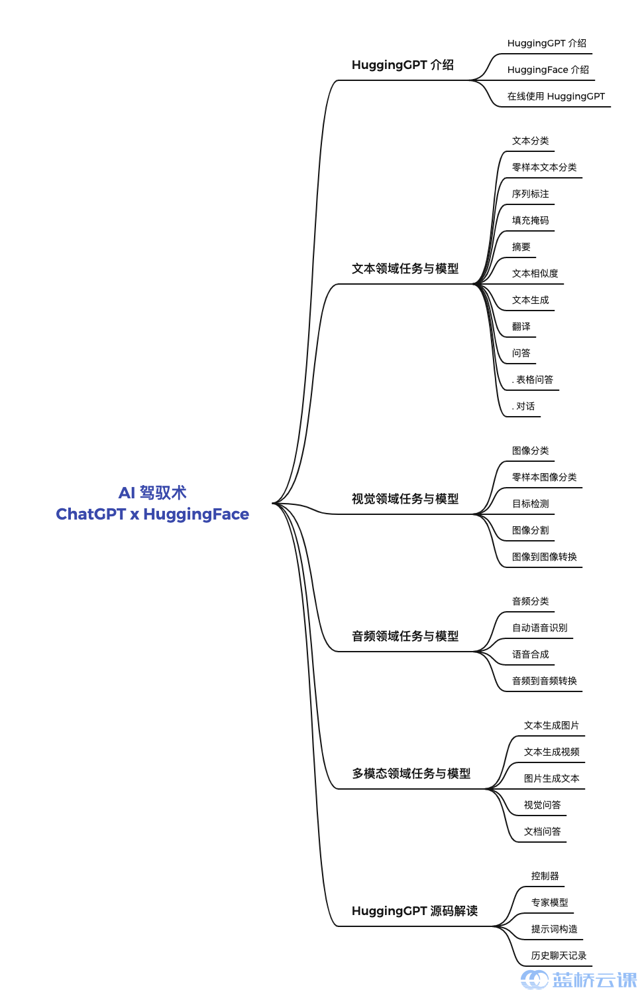

你将学到的

 HuggingGPT 基础认识

 文本领域各任务与模型使用

 视觉领域各任务与模型使用

 音频领域各任务与模型使用

 多模态领域各任务与模型使用

 HuggingGPT 核心源码

详细介绍

在本课程中，我们将一起探索 HuggingGPT，这是一个由大型语言模型作为控制器，众多专家模型作为协作执行者的协作系统。我们将从 HuggingGPT 的基础原理出发，详细介绍其工作流程，包括任务规划、模型选择、任务执行和响应生成这些关键环节。

我们将深入解析各领域（文本，视觉，音频，多模态）的专家模型，让你了解如何利用 HuggingGPT 处理各种复杂任务。无论你是在处理视觉识别任务，还是在进行文本生成，或者是在处理音频信号，甚至是在进行多模态任务，这个课程都将为你提供深入的理论知识和实践技巧。

最后，我们将一起深入源码，从编程的角度理解 HuggingGPT 的运行机制。我们将带你走进代码的世界，让你看到 HuggingGPT 的内部运行逻辑，理解其背后的设计思想。无论你是 AI 初学者，还是已经有一定基础的研究者，这个课程都将为你提供宝贵的学习资源和实践机会，帮助你更好地理解和应用 HuggingGPT。让我们一起踏上这个探索 AI 协作系统的旅程吧！

### 效果展示

<iframe height=450 width=800 src="./README.assets/huggingGPT.mp4" frameborder=0 allowfullscreen> </iframe>

### 适合人群

- 对大语言模型感兴趣，希望了解大语言模型在不同方面的应用的朋友。
- 机器学习领域新生，希望快速了解各个领域的任务。
- 了解 HuggingGPT，希望进一步掌握原理的朋友。